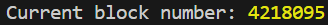

# Setting Up Stability In Ethers

## 1. Introduction

This guide will demonstrate the steps to install Ethers.js and configure the framework for interacting with the Stability blockchain. Ethers.js is a widely used library that enables developers to interact with the Ethereum blockchain and its ecosystem, including custom networks like Stability, in a simple and intuitive way using JavaScript.

### Prerequisites

- Basic knowledge of programming, blockchain, and Javascript.
- Node.js and NPM installed on your system.
- A text editor or IDE for development.

### More Information

The complete code of this tutorial can be found at this [link](https://github.com/stabilityprotocol/tutorials/tree/main/setup-ethers-environment)

## 2. About Ethers

Ethers.js is a compact, complete library for interacting with the Ethereum Blockchain and its ecosystem. It provides a set of tools and functions to connect to standard Ethereum networks, as well as custom ones like the Stability Testnet, making it an ideal choice for blockchain development. Ethers.js simplifies the process of sending transactions, interacting with smart contracts, and handling blockchain data, ensuring developers have a powerful yet straightforward interface for blockchain-based projects.

## 3. Environment

For this setup, we'll be utilizing npm and ethers. This combination allows us to write and execute Javascript directly, facilitating rapid development and testing within the Stability ecosystem.

## 4. Install 

Begin by installing ethers via npm. This step ensures that you have the necessary tools to connect to the Stability blockchain using Javascript.

```bash
npm install ethers
```

## 5. Create an Index.js File 
Next, create a Javascript file named Index.js and paste the following code. This script configures Ethers to connect to the Stability Testnet, allowing you to interact with the blockchain. In this example, we will retrieve the current block number.
```bash

const { JsonRpcProvider } = require('ethers');

const provider = new JsonRpcProvider("https://free.testnet.stabilityprotocol.com");

const logCurrentBlockNumber = async () => {
  try {
    const blockNumber = await provider.getBlockNumber();
    console.log("Current block number:", blockNumber);
  } catch (error) {
    console.error("Error fetching the current block number:", error);
  }
};

logCurrentBlockNumber();
```

## 6. Test in Console
To verify your setup, execute the test script using node. This command will run the index.js file, outputting the current block number of the Stability Testnet to the console.
```bash
node index.js
```

Upon successful execution, you should see a console log displaying the current block number of the Stability blockchain. This step confirms that your Javascript / Ethers setup is correctly configured to interact with the Stability network.


