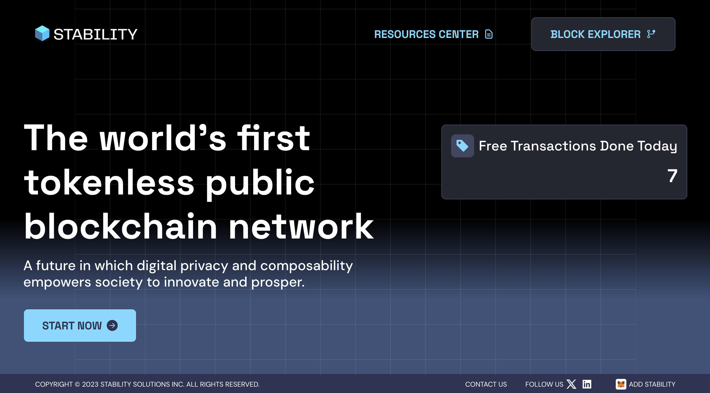
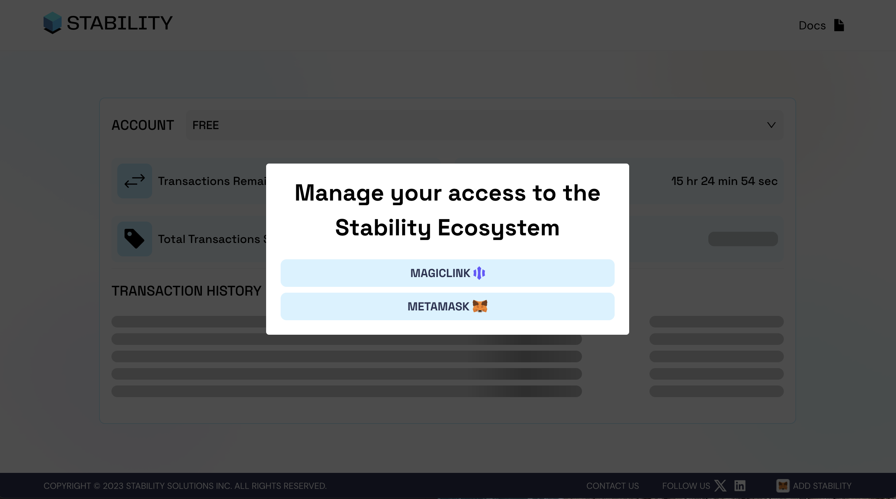

# Account Overview
Check your transaction balance, history, and node upgrade options

1. Navigate to the Stability Portal **[here](https://portal.stble.io/)**
  
  
  
2. Click the **Start Now** button  
  
  

3. Choose between **Magic.link** (for SSO or emailed OTP access) or **Metamask** 

4. Once you log in, you will be able to see your account dashboard that will show your transaction balance and history.
  
_To upgrade your full node to an Enterprise validator node, or buy more batches of transactions for your full node click **Upgrade** in the header. This will redirect you to our Shopify._
  