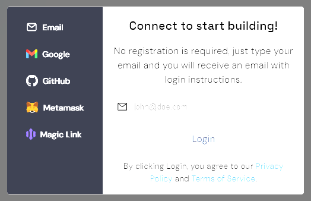
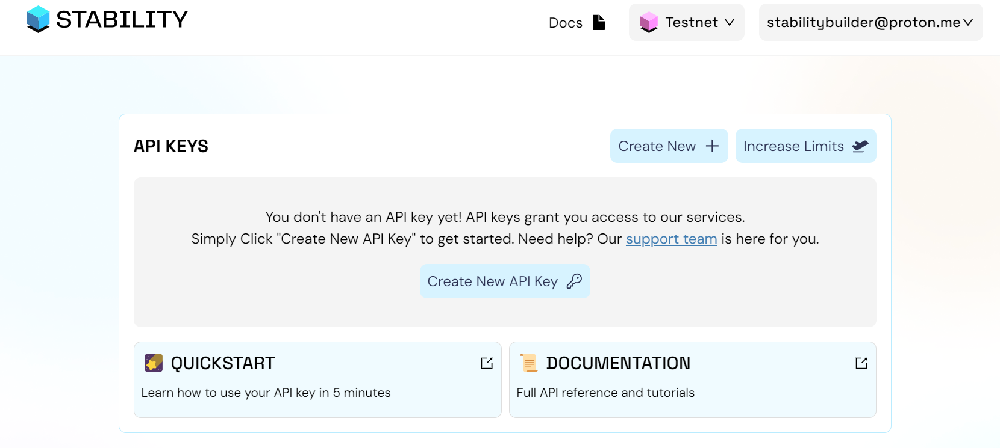

# API Keys

In this tutorial, you will learn how to create an API key on Stability's Account Manager.

Why is needed to have an API key for using Stability? Open version of the API is limitted so a certain amount of transactions (sometimes this amount could be zero) for each address. To increase the number of transactions that a certain user can execute we would have to require users to sign up to our **Account Manager** so we prevent malicious users to execute an unlimitted number of transactions.

## Step 1: Register on Stability's Account Manager

To begin, navigate to Stability's Account Manager page and select your preferred method of registration. To receive a dedicated API key, you must register using either Github, Google, or Email. It's important to note that registrations through Metamask or Magiclink do not provide a dedicated API key.

If you opt to register via email, ensure to verify your email address. Verification is required each time you log in for added security.

## Step 2: Generate Your API Key

Once logged in to Stability's Account Manager, locate the option for generating an API key. Click on the designated button to create your unique API key.

With your API key, you're now equipped to utilize your private RPC on Stability. Click the info button to reveal your private RPC address. Plus, you'll receive 1,000 free credits monthly with your API key, which can be used for any transactions you choose.

## Step 3: Ready to Go!

Congratulations! You've successfully created an API key on Stability's Account Manager. Now, you're all set to use Stability at no cost. Utilize your private RPC to interact with the Stability network using wallets such as Metamask or frameworks like Viem or Ethers.js.
