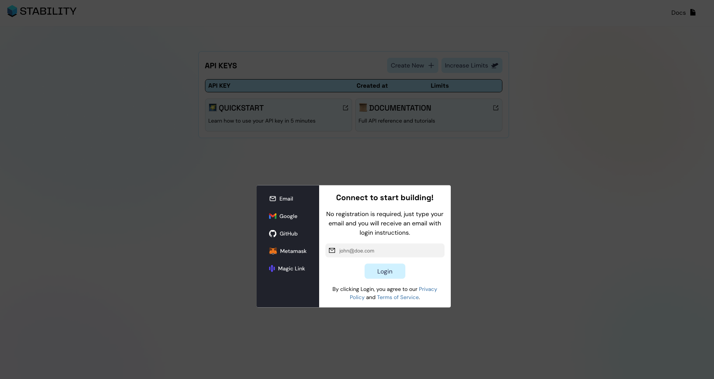
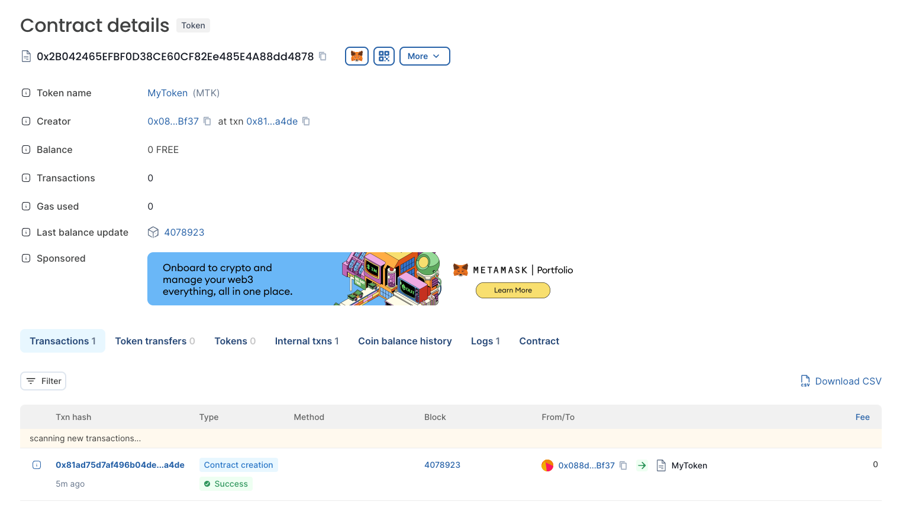

# Quick start - Deploy Contract Using Remix

## 1. Introduction

### Tutorial Objective

This tutorial teaches how to deploy an ERC20 Smart Contract on the Stabilityprotocol blockchain using Remix IDE

Remix is an online smart contract IDE that does not require installation.

### Prerequisites

- Basic knowledge of programming and blockchain
- Metamask installed

## 2. Get an Api Key

In stability, we have created a system where transactions don’t require gas. Instead, our users need to have an API key that identifies them. To get your first API key, you need to visit this website: [link](https://account.stabilityprotocol.com/zgt)

When you visit this website, you will see something similar to this:


You need to choose a login method. You can use a conventional login like email or GitHub, or if you prefer, a more blockchain-oriented login like MetaMask. The choice is yours.

Once you are logged in, click on the 'Create New' button. After this, an API key will appear in the table.

Now, you have an API Key completely ready for use.

## 3. Add stability network to metamask

Once you have your API key, you need to add the Stability Network to your MetaMask using your API key.

To add the Stability Network to MetaMask, visit the network section in your MetaMask -> click on 'Add a Network' -> click on 'Add a network manually'.

After following these instructions, you will arrive at a page like this:


In `Network Name`, type `Stability Network`.

In `New RPC URL`, type `https://free.stble.io?api_key={YOUR_API_KEY}`. Remember to replace `YOUR_API_KEY` with the API key you obtained in step 2.

In `Chain ID`, type `101010`.

In `Currency Symbol`, type `FREE`.

Finally, in 'Block Explorer URL', type `https://stability-mainnet.blockscout.com/`.

Now, you have successfully added the Stability Network to your MetaMask, fully configured with your API Key.

## 4. Setting Up Remix

First, navigate to [Remix IDE](https://remix.ethereum.org/)

Once you are in Remix, create a file inside the 'contracts' folder. For this tutorial, we are going to deploy an ERC20 token, so we will name it 'MyERC20.sol'.

In this file, paste the following code:

```
// SPDX-License-Identifier: MIT
pragma solidity ^0.8.0;

import "@openzeppelin/contracts/token/ERC20/ERC20.sol";

contract MyERC20 is ERC20 {
    constructor(uint256 initialSupply) ERC20("MyToken", "MTK") {
        _mint(msg.sender, initialSupply);
    }
}
```

## 5. Compile contract

Once your contract is finished, you need to compile it. To do this, click on the `Solidity Compiler` option in the left sidebar. You will see something like this:


Then, click on the `Compile MyERC20.sol` button.

Now, your contract is successfully compiled.

## 6. Deploy

Now you need to deploy it. To do this, navigate to the `Deploy & Run Transactions` section using the left sidebar.

There, you will see something like this:


Select `Injected Provider - MetaMask` in the `ENVIRONMENT` input.

In the `Contract` section, choose `MyERC20`.

Then, you will need to set the initial supply of our token, as it is a required variable in the constructor method of the MyERC20 contract.

For example, set the initial supply to `1000000`.

After typing the initial supply, click on the orange button. A MetaMask popover will appear; click on `Confirm` and wait.

After a moment, the contract will be deployed, and you will see something like this:


Congratulations! You now have a smart contract deployed.

If you search for that address in the Stability block explorer, you will see something similar to this:



### Conclusion

Deploying a contract on the Stability network using Remix is very simple, as despite having zero gas transactions, the network maintains EVM compatibility, which allows using all existing tools in the EVM ecosystem to expedite the development of applications.
