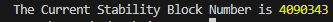

# Setting Up Stability In Viem

## 1. Introduction

This guide will demonstrate the steps to install Viem and configure the framework for interacting with the Stability blockchain. Viem offers a streamlined approach for Ethereum developers looking to engage with Stability, ensuring a smooth development experience.

## 2. About Viem

Viem is a TypeScript interface tailored for interacting with web3, designed to provide developers with low-level, stateless primitives for seamless interaction with blockchains. Key focuses of Viem include:

- Enhancing the developer experience by simplifying complex blockchain interactions.
- Ensuring stability and reliability in application development.
- Minimizing bundle size to improve application performance and loading times.
- Optimizing for performance to handle high-load scenarios efficiently.

## 3. Environment

For this setup, we'll be utilizing npm, ts-node, and Viem. This combination allows us to write and execute TypeScript directly, facilitating rapid development and testing within the Stability ecosystem.

## 4. Install 

Begin by installing Viem and ts-node via npm. This step ensures that you have the necessary tools to create and run TypeScript files that interact with the Stability blockchain.

```bash
npm i viem ts-node
```

## 5. Create a Test.tsx File 
Next, create a TypeScript file named Test.tsx and paste the following code. This script configures Viem to connect to the Stability Testnet, allowing you to interact with the blockchain. In this example, we will retrieve the current block number.
```bash
import { createPublicClient, http, defineChain } from 'viem'

const stbleTestnet = defineChain({
    id: 20180427,
    name: "Stability Testnet",
    network: "stability-testnet",
    nativeCurrency: {
      decimals: 18,
      name: "Decentralized Native Token",
      symbol: "DNT",
    },
    testnet: true,
    blockExplorers: {
      default: {
        name: "Stability Testnet",
        url: "https://stability-testnet.blockscout.com/",
      },
    },
    rpcUrls: {
      default: {
        http: ["https://free.testnet.stabilityprotocol.com"],
      },
      public: {
        http: ["https://free.testnet.stabilityprotocol.com"],
      },
    },
    contracts: {
      multicall3: {
        // https://raw.githubusercontent.com/mds1/multicall/main/src/Multicall3.sol
        address: "0x16A2FBCD44cDF4F282039F2770C5362Cc62CAccD",
        blockCreated: 1318095,
      },
    },
  });
 
const client = createPublicClient({ 
  chain: stbleTestnet, 
  transport: http(), 
}) 

async function getBlockNumber() {
  const blockNumber = Number(await client.getBlockNumber());
  return blockNumber
} 

getBlockNumber().then(blockNumber => {
  console.log('The Current Stability Block Number is', blockNumber);
});
```

## 6. Test in Console
To verify your setup, execute the test script using npx ts-node. This command will compile and run your TypeScript file, outputting the current block number of the Stability Testnet to the console.
```bash
npx ts-node test.tsx
```

Upon successful execution, you should see a console log displaying the current block number of the Stability blockchain. This step confirms that your Viem setup is correctly configured to interact with the Stability network.


