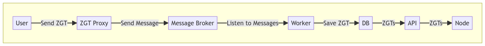

# Architecture

Stability blockchain is composed by two major elements:

- **Stability's Blockchain Client:** A Substrate-based blockchain client whose details are furtherly detailed below at [**Blockchain Client**](#blockchain-client).

- **Zero Gas Transactions Pool System:** A custom transaction pool that enables to execute transactions without paying transaction gas instead other billing mechanisms could be implemented.

## Blockchain Client

Stability is written in the Rust programming language using the **[Substrate](https://github.com/paritytech/polkadot-sdk/tree/master/substrate)** v0.9.36 blockchain framework and the **[Frontier](https://github.com/paritytech/frontier)** suite runtime module. Substrate is an open source Software Development Kit (SDK) created by the Polkadot ecosystem that enables modular and flexible chain development using open protocols to streamline interoperability, such as **[jsonRPC](https://www.jsonrpc.org/specification)** and **[libp2p](https://docs.libp2p.io/concepts/introduction/overview/)**. The SDK provides a library of configurable modules and templates using the **[FRAME](https://docs.substrate.io/reference/frame-pallets/)** development environment to create a custom Substrate runtime. FRAME is composed of three core components: modules, macros, and libraries. These modules are also referred to as pallets and provide core functionality for chain runtime, such as enabling smart contract execution. Frontier is an Ethereum compatibility layer built for the Substrate SDK that enables the execution of unmodified EVM code using **[SputnikVM](https://github.com/rust-blockchain/evm)** as its EVM engine, producing nearly identical results to Ethereum Mainnet.

### Stability Pallets

Substrate, the foundation of Stability, operates using pallets. These are compact modules designed to execute distinct, specialized functions.

The primary pallets of Stability include:

#### Consensus Pallets

- **Aura**: Slot-based round-robin scheduled block creation by a known set of authorities/validator nodes
- **GRANDPA**: Deterministic finality algorithm that uses the longest chain rule requiring a known weighted authority/validator node set, and works in combination with a block production mechanism

#### Frontier Pallets

- **pallet-evm**: Executes Ethereum contract bytecode for smart contracts that are written in Solidity and are then compiled to EVM bytecode, the core responsibility of the EVM
- **pallet-ethereum**: Stores Ethereum formatted blocks, transaction receipts, and transaction statuses

#### Substrate Pallets

- **session**: Enables session key, length, and rotation management
- **timestamp**: Enables getting and setting the on-chain time
- **collective**: Enables a set of account IDs to make collective feelings known through dispatched calls from specialized origins

#### Moonbeam Pallets

- **precompile-utils**: Allows users to read data directly off of the Ethereum JSON-RPC, eliminating the need to use an additional library

#### Custom Pallets

- **custom-balances**: Enables `pallet_evm` to get access to the Decentralized Native Token (DNT) user balance
- **dnt-fee-controller**: Manages fee payment to validators and dApps, to enable Business Shared Revenue (BSR)
- **erc20-manager**: Used to manage memory access as well as control overflow and underflow to modify contract storage to reflect changes in balances, to be able to use ERC-20 for paying fees
- **fee-rewards-vault**: Enables a space to hold fee rewards, giving support to the `FeeRewardsVaultController`
- **root-controller**: Enables privileged calls and origins
- **sponsored-transactions**: Allows for a third-party to pay the fees of a standard transaction, in the event that Zero Gas Transactions (ZGT) is not used
- **token-fee-controller**: Enables Decentralized Native Token (DNT) with a user fee selector and validator fee selector, from the `SupportedTokensManager`
- **upgrade-runtime-proposal**: Used to update the runtime
- **validator-set**: Used to manage validators, such as adding and removing validators
- **zero-gas-transactions**: Enables non-financial transaction execution

For more information about pallets you can reference the `substrate_node` API documentation **[here](https://paritytech.github.io/polkadot-sdk/master/substrate_node/index.html)**.

## Zero Gas Transaction (ZGT)

Zero Gas Transactions is the unique solution of Stability for enabling the usage of blockchain without the friction of using cryptocurrency, enhancing this way UX and helping non-Web3 companies onboard and leverage the utility of this technology.

### How it works?

In Stability, validators have the ability to reserve a segment of the block for feeless transactions. This approach allows validators to explore alternative business models for transaction validation that are not influenced by the volatility of the fee market.

### Stability ZGT Pool

Using the ZGT framework of Stability blockchain client, we developed a ZGT pool that is supported by all our validators, enabling the execution of feeless transactions. For using this service, go to [**ZGT Portal Root**](https://portal.stble.io).

Stability ZGT mempool consists of three main components:

- **Proxy**: Is the entrypoint of system to which the user will connect, is a wrapped RPC connection to Stability.
- **API**: Is the endpoint used by the validator's to retrieve pending zero gas transactions.
- **Worker**: Both proxy and API generate some backgrounds task to perform, the worker is incharged of executing them.

