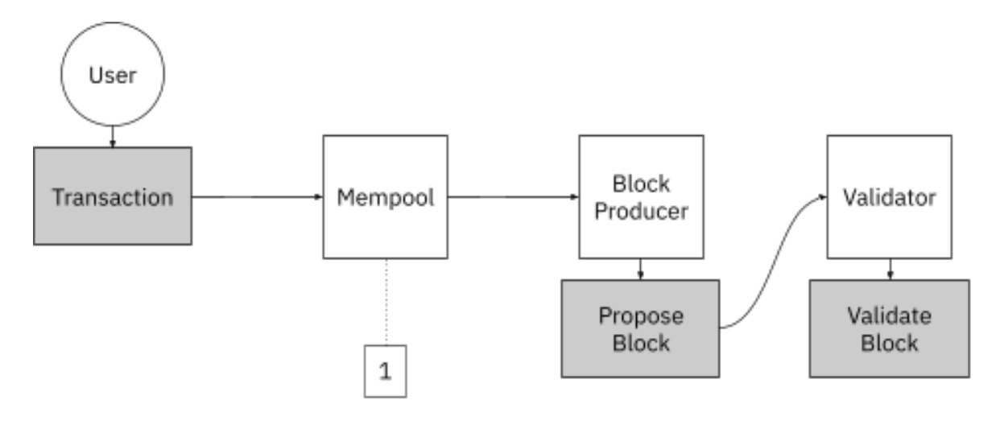

# Intro to Blockchain Technology
_Introduction to blockchain technology_  
#    
A blockchain is a decentralized, digital ledger distributed among nodes of a peer-to-peer network that can store data of any kind, similar to a conventional database. The difference however, is that the risk of a single point of failure is eliminated as data is not owned and controlled by a central authority. This decentralized architecture has inherent redundancy and ultimate resilience against security and access related vulnerabilities that are commonplace in centralized storage systems.  
  
This digital ledger is made up of incremental blocks of data. As new data is added, a new block is created and attached to the chain by approved actors called validator nodes. These validators verify and confirm the legitimacy of data using a consensus mechanism, powered by cryptography, to achieve distributed agreement about the ledger's state. These validation requests, also commonly referred to as transactions, are queued in what is called a “mempool”.  

  
  
Cryptocurrency is one of the most common uses of blockchain technology today, where purchases, sales, exchanges, and spend is recorded as transactions in a block on a blockchain. Although this use case has gained popularity, it has also caused unnecessary monetization and subsequent governance and regulation, as every action on-chain is a financial transaction.  
  
**The Stability team has shifted this known paradigm of blockchain technology by making these actions non-financial by default, and rather optional. This brings focus more towards utility as opposed to monetization of transactions, and micro-transactions, further democratizing access to the most transformational technology of the digital age.  
**
