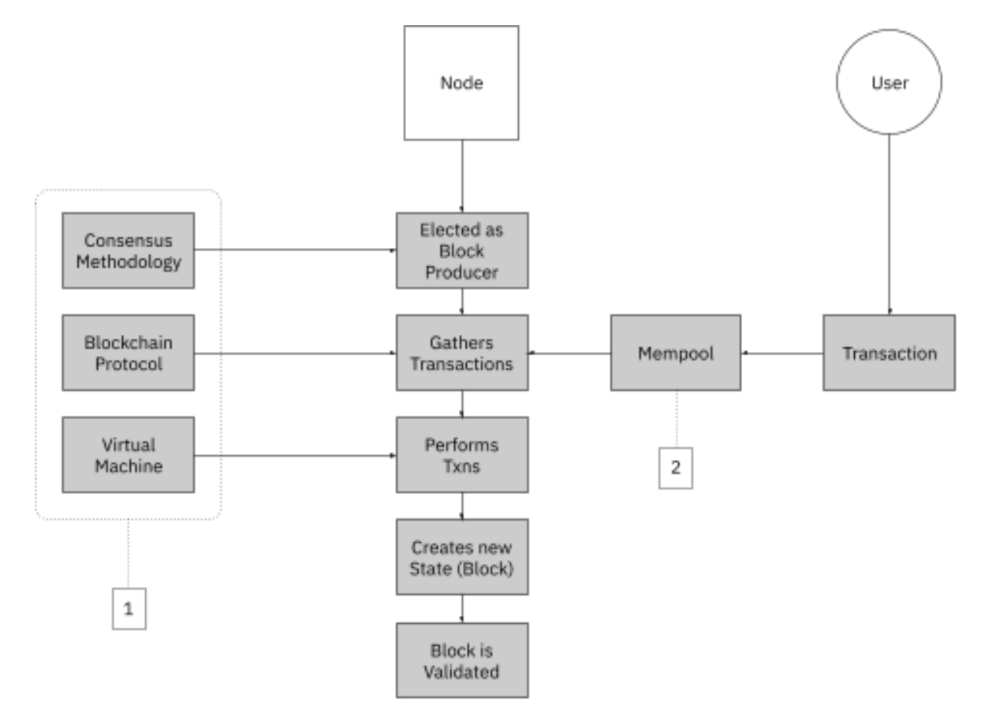

# Nodes
Node Types, Node Keys, and Running Nodes

Nodes are network stakeholders that run the protocol software responsible for maintaining a distributed ledger and serves as a communication hub.

  

## Node Types

There are two main node types on the Stability blockchain, below you will find details about each:

**Full Nodes (FNs)** contain the last 256 blocks, has read only access to data

**Validator Nodes (VNs)** contain the last 256 blocks, run distributed consensus to execute and store transactions on the blockchain and communicate directly with other nodes, and are used to state sync with other nodes

**Archive Nodes (ANs)** contain all blocks, beginning from the first block in the blockchains history, and are used to state sync with other nodes

## Node Keys
Stability nodes use 2 keys to operate:
- ECDSA for Aura (Stability's consensus mechanism)
- ED25519 for Grandpa (Stability's finality mechanism)

We recommend generating a single SEED for these keys, using it to produce the necessary keys.

_To launch a node please visit the **[Builder](../builders/)** guides_

