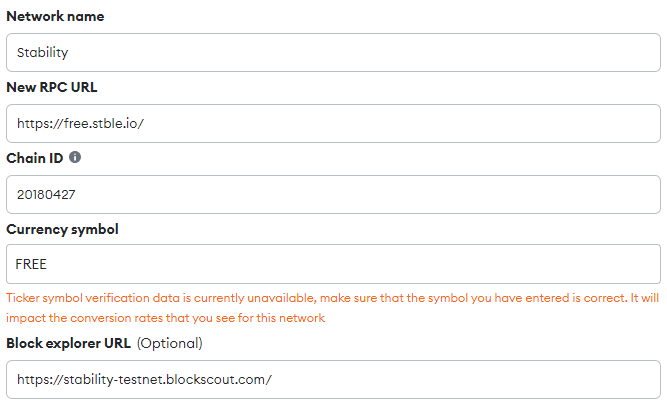

# MetaMask

# Adding Stability Network to MetaMask

This guide provides step-by-step instructions on how to add the Stability network to MetaMask.

## Steps

1. **Access MetaMask Extension**

    Click on the MetaMask extension icon in your browser.

2. **Open Settings**

    Inside the MetaMask interface, click on the menu icon (three horizontal lines) and then select `Settings`.

3. **Navigate to Networks**

    In the `Settings` menu, find and click on `Networks`.

4. **Add New Network**

    Click on `Add Network` to start the process of adding a new network.

5. **Choose Manual Addition**

    Select the option to `Add A Network Manually`.

6. **Enter Network Details**

    

    Fill in the network details as follows:

    - **Network Name:** Stability
    - **New RPC URL:** `https://free.stble.io/`
    - **Chain ID:** 20180427
    - **Currency Symbol:** FREE
    - **Block Explorer URL:** `https://stability-testnet.blockscout.com/`

    Note: You may encounter a warning regarding the currency symbol. This is expected, as the Stability network does not use a currency for gas fees. The network can be used without a currency balance.

7. **Save and Connect**

    After entering all the information, click `Save`. MetaMask will automatically connect to the newly added network.

## Conclusion

You have now successfully added the "Stability" network to your MetaMask wallet. You can switch between networks using the network dropdown menu in the MetaMask interface.