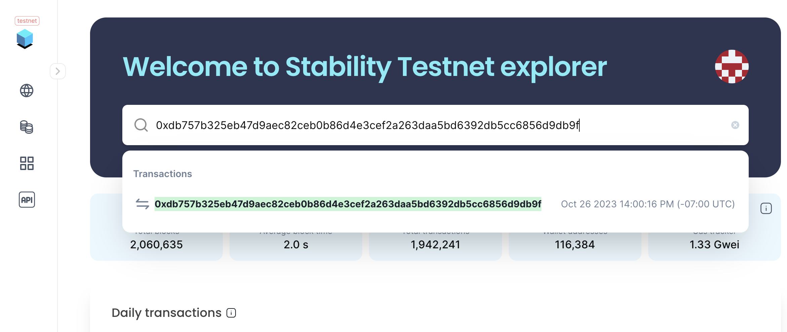

# Block Explorer
The Stability Block Explorer allows you to inspect, analyze, and interact with real-time data on Stability Chain Mainnet and Testnet.

To learn more about what's on the block explorer click **[here](../../resources/block_explorer.md)**

To access the Block Explorer:
1. Click **[here](https://stability-testnet.blockscout.com/)**

2. You can search by address, tx hash, block, token, and more.

_Note: You can see your personal transaction history in your Account Overview, and if you want extra details you can click any of the transactions or paste the address into the Explorer directly_